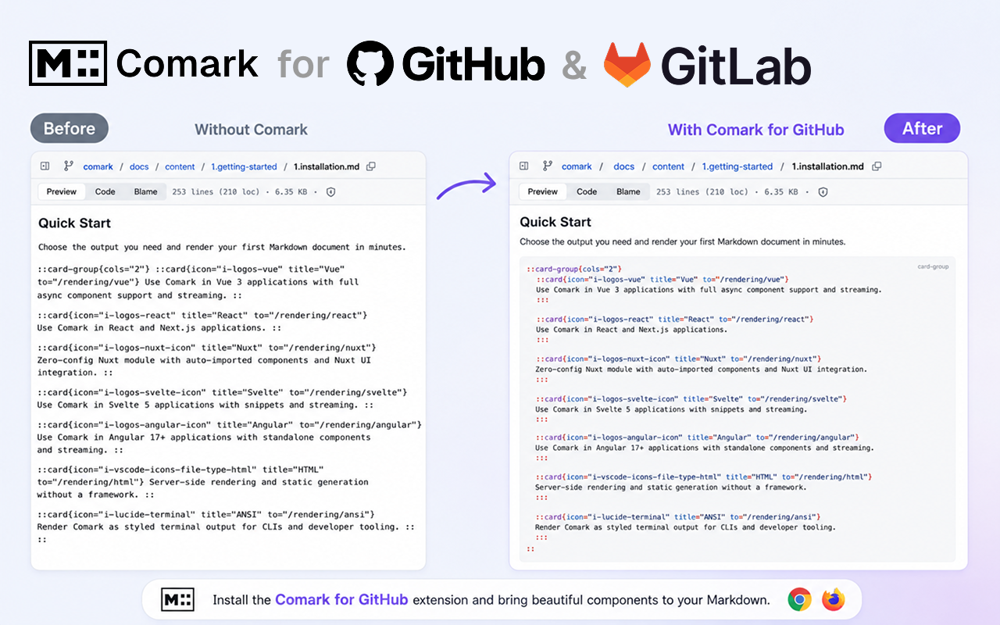

# Comark for GitHub & GitLab

[](https://chromewebstore.google.com/detail/comark-for-github/mbbnjnblfplfjkakjfjkhhefhcdnhcin)
[](https://addons.mozilla.org/en-GB/firefox/addon/comark-for-github/)

A browser extension (Chrome, Firefox) that fixes GitHub and GitLab's rendering of Markdown files written with [Comark](https://comark.dev) syntax — components, attributes, spans and bindings.

Git hosting Markdown renderers do not understand the Comark extensions: block components leak as plain paragraphs or broken headings, attribute groups show up as stray braces, and `mdc` code fences stay unhighlighted. With this extension installed, those files become readable again.

## Install

### Chrome / Edge / Chromium

Install directly from the **[Chrome Web Store](https://chromewebstore.google.com/detail/comark-for-github/mbbnjnblfplfjkakjfjkhhefhcdnhcin)**.

Alternatively, grab the latest pack from the [releases page](https://github.com/comarkdown/comark-webext/releases/latest):

1. Download [`comark-for-github.zip`](https://github.com/comarkdown/comark-webext/releases/latest/download/comark-for-github.zip) and unzip it.
2. Open `chrome://extensions` and turn on **Developer mode** (top right).
3. Click **Load unpacked** and select the unzipped folder.

### Firefox

Install directly from **[Firefox Add-ons](https://addons.mozilla.org/en-GB/firefox/addon/comark-for-github/)**.

Alternatively, load the latest release manually:

1. Download [`comark-for-github.xpi`](https://github.com/comarkdown/comark-webext/releases/latest/download/comark-for-github.xpi).
2. Open `about:debugging#/runtime/this-firefox`.
3. Click **Load Temporary Add-on** and select the `.xpi` file.

> Firefox removes temporary add-ons on restart.

Then open a Comark-flavored Markdown file on GitHub or GitLab, for example [`docs/content/index.md`](https://github.com/comarkdown/comark/blob/main/docs/content/index.md) from the comark repo.

## Enjoy

```comark
# Enjoy highlighted syntax

After installing the extension, refresh this page and you will see that the next lines are highlighted.

::alert{type="warning"}
This is **Markdown** inside your own component.
::
```

## What it does

On `github.com` and `gitlab.com`, for READMEs and `.md` blob previews:

1. **Detects Comark syntax.** The extension fetches and scans the raw Markdown source. Plain Markdown files are left untouched.
2. **Re-renders the whole document with Comark.** The raw source is parsed by the real Comark parser and rendered to HTML with [`@comark/html`](https://www.npmjs.com/package/@comark/html), replacing the host's lossy rendering.
3. **Shows Comark syntax as highlighted code:**
   - Block components (`::card` … `::`) become syntax-highlighted code blocks of their original source, YAML props included, with a component-name badge.
   - Inline components (`:badge[New]{color="blue"}`), attribute groups (`**bold**{.accent}`), spans (`[text]{.mark}`) and bindings (`{{ user.name }}`) become highlighted inline code.
4. **Highlights code fences** with [rangi](https://github.com/pi0/rangi) — including ` ```mdc ` / ` ```comark ` fences, which hosts leave plain. On non-Comark pages, `mdc` fences are highlighted in place without touching anything else.

Everything follows GitHub and GitLab light, dark, and auto color modes.

### Safety

- The rendered HTML goes through Comark's `security` plugin: `<script>`/`<iframe>`-style tags are dropped, event-handler attributes are stripped, and `javascript:` URLs are not rendered.
- If rendering fails for any reason, the host's original rendering is kept.
- A popup toggle enables/disables the extension (toggling reloads open GitHub and GitLab tabs).

### Known trade-offs

- On re-rendered pages, host-provided extras are lost, such as heading hover anchors, image proxies, and copy buttons on code fences. Relative links and images are rewritten so they keep working.
- Bare domains (`example.com` without a protocol) are not auto-linked, since linkify would mangle `{{ dotted.path }}` bindings.

## Development

```bash
pnpm i
pnpm dev
```

Then **load the `extension/` folder in your browser** (Chrome: `chrome://extensions` → Developer mode → Load unpacked).

For Firefox:

```bash
pnpm dev-firefox
pnpm start:firefox
```

Good pages to test on:

- https://github.com/comarkdown/comark/blob/main/docs/content/index.md
- https://github.com/comarkdown/comark/blob/main/docs/content/2.syntax/2.components.md

### Tests

```bash
pnpm test        # vitest — scanner, renderer and DOM transform (real GitHub fixtures)
pnpm typecheck
pnpm lint
```

### Build

```bash
pnpm build
```

Then pack the files under `extension/`: `pnpm pack:zip`, `pnpm pack:crx` or `pnpm pack:xpi`.

## Project structure

- `src/contentScripts/comark/` - the core logic
  - `hosting.ts` - GitHub and GitLab page detection, raw source fetching, soft-navigation handling
  - `scanner.ts` - regex scan of the raw source (Comark syntax gate + inline fragments)
  - `renderer.ts` - full Comark HTML rendering with component/span handlers
  - `transform.ts` - DOM replacement, inline code wrapping, fence highlighting
  - `highlight.ts` - rangi wrappers with the Comark grammar
  - `style.css` - injected styles, mapped to GitHub's CSS variables
- `src/popup/` - the enable/disable popup
- `src/manifest.ts` - the extension manifest (generated to `extension/manifest.json`)
- `src/tests/` - vitest specs with real GitHub HTML fixtures

## Releases

### Store releases (patch / minor / major)

Two ways to cut a release:

- **Locally**: run `pnpm release`, pick the bump. [bumpp](https://github.com/antfu-collective/bumpp) updates `package.json`, commits `chore: release vX.Y.Z`, tags and pushes.
- **From the GitHub UI** (works on mobile): Actions → **Version** → Run workflow → pick `patch`/`minor`/`major`. Requires write access.

The `vX.Y.Z` tag triggers `.github/workflows/publish.yml`, which:

1. runs all checks and builds both flavors
2. publishes a GitHub release with `comark-for-github.zip` (Chrome) and `comark-for-github.xpi` (Firefox)
3. uploads the zip to the [Chrome Web Store](https://chromewebstore.google.com/detail/comark-for-github/mbbnjnblfplfjkakjfjkhhefhcdnhcin) and publishes it for review
4. submits the Firefox build (with its source archive) to [Firefox Add-ons](https://addons.mozilla.org/en-GB/firefox/addon/comark-for-github/) for review

Required repository secrets: `CWS_EXTENSION_ID`, `CWS_CLIENT_ID`, `CWS_CLIENT_SECRET`, `CWS_REFRESH_TOKEN` (Chrome Web Store API) and `AMO_JWT_ISSUER`, `AMO_JWT_SECRET` (AMO API).

### CI prereleases

Every other push to `main` runs the checks and publishes a `vX.Y.Z-build.N` **prerelease** — see `.github/workflows/release.yml`. `releases/latest` always points to the last store-grade release.

No `.crx` is published: Chrome on Windows/macOS rejects crx files that do not come from the Chrome Web Store (`CRX_REQUIRED_PROOF_MISSING`). Install from the [Chrome Web Store](https://chromewebstore.google.com/detail/comark-for-github/mbbnjnblfplfjkakjfjkhhefhcdnhcin) or use the zip with **Load unpacked**.

## Notes

- `comark` and `@comark/html` are currently installed from [pkg.pr.new](https://pkg.pr.new) builds of [comarkdown/comark#352](https://github.com/comarkdown/comark/pull/352). Switch to the npm releases once the PR ships.

## Credits

Built on [vitesse-webext](https://github.com/antfu/vitesse-webext) by [Anthony Fu](https://github.com/antfu) — Vite-powered WebExtension starter with Vue 3, HMR and dynamic manifest.

## License

[MIT](./LICENSE) — Comark team and contributors.
